# 김재현의 Next js 블로그 🚀

## 🌐 사이트 정보

- **블로그 주소**: [kimjaahyun.com](https://kimjaahyun.com)
- **배포 환경**: Vercel
- **개발 환경**: Next.js 15 + TypeScript

## ✨ 주요 기능

### 📝 콘텐츠

- **MDX 지원**: 마크다운에서 React 컴포넌트 직접 사용
- **수학 공식**: KaTeX를 이용한 LaTeX 수식 렌더링
- **Mermaid 다이어그램**: 플로우차트, 시퀀스 다이어그램 등 렌더링
- **마크다운 표**: remark-gfm을 이용한 GitHub Flavored Markdown 지원
- **다국어 지원**: 한국어/영어 자동 번역 및 로케일 라우팅
- **반응형 디자인**: 모바일/데스크톱 최적화
- **Summary/Details**: 접을 수 있는 콘텐츠 섹션

### 🎨 사용자 경험

- **다크 테마**: 시스템 설정에 따른 자동 테마 전환
- **검색 기능**: 블로그 포스트 전체 검색 (로딩 인디케이터 포함)
- **인터랙션**: 댓글, 좋아요, 조회수 시스템 (Supabase)
- **이메일 알림**: 댓글 및 답글 작성 시 자동 알림 전송

### 🔍 SEO 최적화

- **검색 엔진 등록**: Google, Bing, Yandex, Naver 등록
- **Google Indexing API**: 자동 인덱싱 요청
- **IndexNow API**: Bing, Yandex, Naver 실시간 색인 업데이트
- **Sitemap**: 자동 생성 및 최적화
- **Meta Tags**: 최적화된 메타 설명 (25-160자)
- **Canonical URL**: 중복 콘텐츠 방지
- **JSON-LD**: 구조화된 데이터 마크업

### 📊 성능 및 분석

- **Vercel Speed Insights**: 성능 모니터링
- **접근성 최적화**: WCAG 가이드라인 준수
- **Core Web Vitals**: 사용자 경험 지표 최적화

## 🛠 기술 스택

### 프론트엔드

- **Next.js 15** - App Router, Server Components
- **React 19** - 최신 React 기능
- **TypeScript** - 타입 안정성
- **TailwindCSS 4** - 유틸리티 퍼스트 CSS
- **next-themes** - 다크 모드 지원

### 콘텐츠 관리

- **MDX** - 마크다운 + React 컴포넌트
- **gray-matter** - 프론트매터 파싱
- **remark-math + rehype-katex** - 수학 공식 렌더링
- **remark-gfm** - GitHub Flavored Markdown (표, 체크박스 등)
- **Mermaid** - 다이어그램 렌더링

### 백엔드 & 데이터베이스

- **Supabase** - 댓글, 좋아요, 조회수, 사용자 인증
- **PostgreSQL** - 관계형 데이터베이스
- **Email API** - 댓글/답글 알림 시스템

### 국제화

- **next-intl** - 다국어 지원 및 라우팅

### SEO & 성능

- **Google Indexing API** - 자동 색인 요청
- **IndexNow API** - 실시간 검색엔진 업데이트
- **Vercel Speed Insights** - 성능 모니터링

## 🚀 로컬 개발 환경 설정

### 1. 저장소 클론

```bash
git clone https://github.com/username/blog-next.git
cd blog-next
```

### 2. 의존성 설치

```bash
yarn install
```

### 3. 환경 변수 설정

`.env.local` 파일을 생성하고 다음 변수들을 설정하세요:

```env
# Supabase
NEXT_PUBLIC_SUPABASE_URL=your_supabase_url
NEXT_PUBLIC_SUPABASE_ANON_KEY=your_supabase_anon_key

# Email notifications (선택사항)
EMAIL_API_KEY=your_email_api_key

# SEO APIs (선택사항)
GOOGLE_INDEXING_API_KEY=your_google_api_key
INDEXNOW_API_KEY=your_indexnow_key
```

### 4. 개발 서버 실행

```bash
yarn dev
```

브라우저에서 [http://localhost:3000](http://localhost:3000)을 열어 결과를 확인하세요.

## 📁 프로젝트 구조

```
├── app/                    # Next.js App Router
│   ├── [locale]/          # 다국어 라우팅
│   ├── components/        # React 컴포넌트
│   │   ├── MermaidDiagram.tsx  # Mermaid 다이어그램
│   │   ├── CommentSection.tsx  # 댓글 시스템
│   │   └── SearchModal.tsx     # 검색 모달
│   ├── api/              # API 라우트
│   │   ├── email/        # 이메일 알림 API
│   │   └── search/       # 검색 API
│   └── globals.css       # 전역 스타일
├── contents/             # MDX 블로그 포스트
├── lib/                  # 유틸리티 함수
│   ├── email.ts          # 이메일 서비스
│   └── supabase.ts       # Supabase 클라이언트
├── messages/             # 다국어 메시지
├── public/               # 정적 파일
├── scripts/              # 유틸리티 스크립트
│   ├── google-indexing-api.js  # Google 색인 API
│   └── indexnow.js            # IndexNow API
├── sql/                  # 데이터베이스 스키마
└── theme/                # 테마 설정
```

## 📝 블로그 포스트 작성

### MDX 파일 구조

````markdown
---
title: "포스트 제목"
description: "포스트 설명"
date: "2024-01-01"
tags: ["AI", "통계학"]
---

# 포스트 내용

수학 공식도 사용 가능:
$$E = mc^2$$

Mermaid 다이어그램:

```mermaid
graph TD
    A[시작] --> B[처리]
    B --> C[끝]
```


````

| 표     | 헤더 |
| ------ | ---- |
| 데이터 | 값   |

<CustomComponent />
```

### 지원 기능

- ✅ 마크다운 문법
- ✅ React 컴포넌트 임베딩
- ✅ LaTeX 수식
- ✅ Mermaid 다이어그램
- ✅ 마크다운 표 (GFM)
- ✅ 코드 하이라이팅
- ✅ 이미지 최적화
- ✅ Summary/Details 접기 섹션

## 💬 댓글 시스템

- **실시간 댓글**: Supabase를 통한 실시간 댓글 시스템
- **답글 기능**: 댓글에 대한 답글 작성
- **이메일 알림**: 새 댓글/답글 작성 시 자동 이메일 알림
- **다국어 지원**: 한국어/영어 댓글 인터페이스

## 🔧 배포

### Vercel 배포

1. Vercel에 프로젝트 연결
2. 환경 변수 설정
3. 자동 배포 완료
4. Speed Insights 자동 활성화

### 빌드 명령어

```bash
yarn build    # 프로덕션 빌드
yarn start    # 프로덕션 서버 실행
yarn lint     # ESLint 검사
```

## 🔍 SEO 설정

### 자동 색인 등록

- **Google**: Indexing API를 통한 자동 등록
- **Bing/Yandex/Naver**: IndexNow API를 통한 실시간 업데이트

### 검색 엔진 등록

- Google Search Console
- Bing Webmaster Tools
- Yandex Webmaster
- Naver Search Advisor

## 📄 라이선스

이 프로젝트는 MIT 라이선스 하에 배포됩니다. 자세한 내용은 [LICENSE](LICENSE) 파일을 참조하세요.

## 📞 연락처

- **블로그**: [kimjaahyun.com](https://kimjaahyun.com)
- **이메일**: [kimjaahyun@kimjaahyun.com](mailto:kimjaahyun@kimjaahyun.com)
- **GitHub**: [oooo12-git](https://github.com/oooo12-git)

---

**Built with ❤️ using Next.js and modern web technologies**
