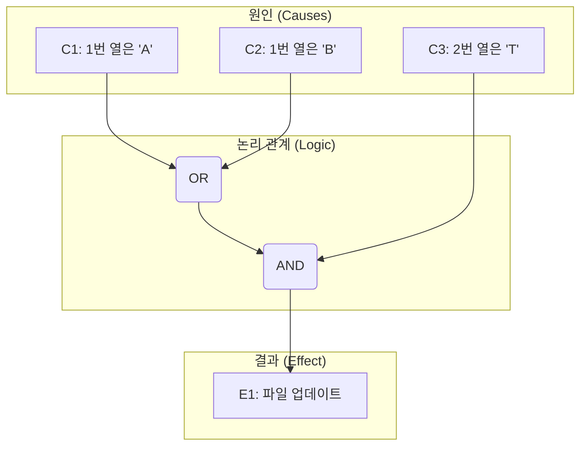
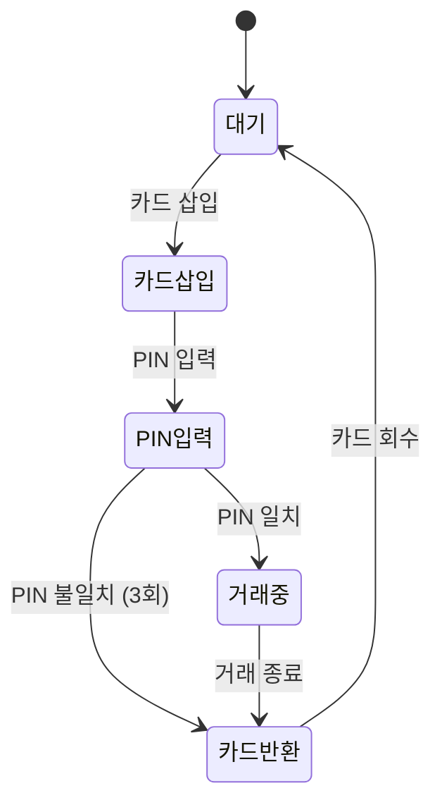
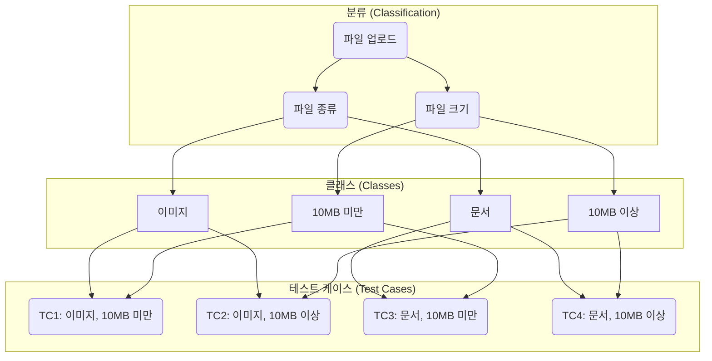

import ProblemAnswer from "@/app/components/ProblemAnswer";

export const metadata = {
  title: "⬛ 블랙박스 테스트 유형 정리 | 🚀 정처기 실기 대비 문제 포함",
  description:
    "소프트웨어 테스트의 핵심인 블랙박스 테스트의 개념과 주요 유형(동등 분할, 경곗값 분석, 원인-결과 그래프, 오류 예측, 결정 테이블)을 알아보고, 정보처리기사 실기 대비 문제로 학습을 마무리합니다.",
  publishedAt: "2025-07-12",
  lastModifiedAt: "2025-07-13",
  timeToRead: 0,
  tags: ["소프트웨어 테스트", "블랙박스 테스트", "정처기", "테스트 케이스"],
  heroImage: "/contents/blackbox-test-for-exam/blackbox-testing-types.webp",
};

> 💡 정처기 실기 대비를 위한 주관식 문제는 포스팅 마지막에 있습니다. 문제를 여러번 푸는 걸 권장합니다.

> ❗️각 테스트 유형의 개념과 언제 사용되는지를 이해하는 것이 중요합니다.

## 🚀 블랙박스 테스트란?

**블랙박스 테스트(Black-box Test)** 는 소프트웨어의 내부 구조나 소스 코드를 보지 않고, 오직 **요구사항 명세**를 보면서 기능이 올바르게 동작하는지를 검사하는 테스트 방법입니다. 사용자의 관점에서 테스트하는 것과 같으며, **명세 기반 테스트** 또는 **기능 테스트**라고도 불립니다.

## ⬛ 블랙박스 테스트 유형 한눈에 보기

| 테스트 유형                 | 핵심 개념                                                         |
| :-------------------------- | :---------------------------------------------------------------- |
| **동등 분할 테스트**        | 입력 조건을 유효/무효 클래스로 나누어 테스트                      |
| **경곗값 분석 테스트**      | 분할된 클래스의 경계값을 집중적으로 테스트                        |
| **결정 테이블 테스트**      | 복잡한 논리적 조건과 그에 따른 행동을 표로 정리                   |
| **원인-결과 그래프 테스트** | 입력(원인)과 출력(결과)의 논리적 관계를 그래프로 표현             |
| **상태 전이 테스트**        | 시스템의 상태 변화를 기반으로 테스트 케이스 설계                  |
| **오류 예측 테스트**        | 테스터의 경험과 직관으로 오류가 발생할 만한 부분을 예측           |
| **비교 테스트**             | 동일한 기능의 여러 버전 또는 제품을 비교하여 테스트               |
| **페어와이즈 테스트**       | 모든 가능한 입력 값 조합 대신, 입력 값들의 모든 쌍(pair)을 테스트 |
| **분류 트리 테스트**        | 테스트 관련 요소를 트리 구조로 분석하고 테스트 케이스 도출        |
| **유스케이스 테스트**       | 사용자의 시나리오(유스케이스)를 기반으로 테스트                   |

---

## 1. 🧩 블랙박스 테스트 상세 유형

### 1. 동등 분할 테스트 (Equivalence Partitioning)

입력 데이터의 영역을 유효한(valid) 그룹과 무효한(invalid) 그룹으로 나누고, 각 그룹에서 대표값을 하나씩 선택하여 테스트 케이스를 설계하는 방법입니다. 모든 입력값을 테스트하지 않고도 효율적으로 테스트할 수 있습니다.

- **예시**: 시험 점수(1점 ~ 100점)를 입력하는 시스템
  - **유효 파티션**: 1 이상 100 이하의 값 (e.g., 50)
  - **무효 파티션**: 1 미만의 값 (e.g., 0), 100 초과의 값 (e.g., 101)

### 2. 경곗값 분석 테스트 (Boundary Value Analysis)

오류는 대부분 입력값의 경계에서 발생한다는 특징을 이용한 테스트 기법입니다. 동등 분할 후, 각 분할의 경계값을 집중적으로 테스트합니다.

- **예시**: 시험 점수(1점 ~ 100점)를 입력하는 시스템
  - **경계값**: 0, 1, 2 (최소 경계) 그리고 99, 100, 101 (최대 경계)

### 3. 결정 테이블 테스트 (Decision Table Testing)

요구사항의 복잡한 논리적 조건과 그에 따라 시스템이 취해야 할 행동을 체계적으로 정리한 표(테이블)를 기반으로 테스트 케이스를 설계하는 방법입니다.

- **예시**: 쇼핑몰 할인 정책을 나타낸 결정 테이블

  | 규칙             | 1   | 2   | 3   |
  | :--------------- | :-- | :-- | :-- |
  | **조건**         |     |     |     |
  | VIP 회원         | T   | F   | F   |
  | 10만원 이상 구매 | T   | T   | F   |
  | 쿠폰 사용        | T   | F   | F   |
  | **행동**         |     |     |     |
  | 20% 할인         | X   |     |     |
  | 5% 할인          |     | X   |     |
  | 할인 없음        |     |     | X   |

### 4. 원인-결과 그래프 테스트 (Cause-Effect Graphing)

입력 데이터 간의 관계나 출력에 영향을 미치는 상황을 체계적으로 분석하여, 효용성 높은 테스트 케이스를 선정하는 기법입니다. 입력(원인)과 출력(결과) 사이의 논리적 관계를 그래프로 표현합니다.

- **예시**: 특정 조건이 만족될 때 파일이 업데이트되는 시스템
  - **원인(Causes)**
    - C1: 1번 열의 문자는 'A'이다.
    - C2: 1번 열의 문자는 'B'이다.
    - C3: 2번 열의 문자는 'T'이다.
  - **결과(Effect)**
    - E1: 파일이 업데이트된다.
  - **논리**: (C1 또는 C2) 그리고 C3가 참일 때 E1이 발생한다.

이를 머메이드 다이어그램으로 표현하면 다음과 같습니다.

이 그래프를 바탕으로 다음과 같은 결정 테이블을 만들고 테스트 케이스를 도출할 수 있습니다.

| 규칙         | 1   | 2   | 3   | 4   |
| :----------- | :-- | :-- | :-- | :-- |
| **원인**     |     |     |     |     |
| C1: 1열='A'  | T   | F   | F   | F   |
| C2: 1열='B'  | F   | T   | F   | F   |
| C3: 2열='T'  | T   | T   | F   | T   |
| **결과**     |     |     |     |     |
| E1: 업데이트 | X   | X   |     |     |

### 5. 상태 전이 테스트 (State Transition Testing)

시스템의 상태가 특정 이벤트에 의해 어떻게 변하는지를 분석하고 테스트하는 기법입니다. 상태 전이도(State Transition Diagram)를 작성하여 테스트 케이스를 설계합니다.

- **예시**: ATM 기기
  - **상태**: 대기, 카드 삽입, PIN 입력, 거래 중, 카드 반환
  - **이벤트**: 카드 삽입, PIN 번호 입력, 금액 인출 요청, 거래 종료

아래는 ATM 기기의 상태 변화를 나타낸 상태 전이도입니다.

### 6. 오류 예측 테스트 (Error Guessing)

테스터의 경험과 직관을 바탕으로 시스템에 어떤 오류가 있을지 예측하고, 그 오류를 검증하는 테스트 케이스를 설계하는 기법입니다. 정형화된 규칙은 없지만, 다른 기법들이 놓칠 수 있는 오류를 찾는 데 효과적입니다.

- **예시**: 로그인 폼에 비밀번호 대신 아이디 입력, 숫자 필드에 문자 입력, 필수 입력값 비워두기 등

### 7. 비교 테스트 (Comparison Testing)

동일한 테스트 자료를 가지고 여러 버전의 프로그램이나 경쟁사 제품과 비교하며 테스트하는 기법입니다.

### 8. 페어와이즈 테스트 (Pairwise Testing)

모든 가능한 입력 파라미터의 조합을 테스트하는 대신, **최소한의 테스트 케이스로 모든 파라미터 값들의 쌍(pair)을 한 번씩은 테스트**하도록 조합을 만드는 기법입니다. 파라미터가 많아질수록 조합의 수가 기하급수적으로 늘어나는 '조합 폭발' 문제를 해결하는 데 매우 효과적입니다.

- **예시**: 웹사이트 설정 (OS: Win, Mac / 브라우저: Chrome, Firefox / 언어: 한국어, 영어)
  - 모든 조합(2x2x2=8) 대신, 아래 4가지 케이스만으로 모든 쌍(OS-브라우저, OS-언어, 브라우저-언어)을 테스트할 수 있습니다.
    1. Win - Chrome - 한국어
    2. Win - Firefox - 영어
    3. Mac - Chrome - 영어
    4. Mac - Firefox - 한국어

### 9. 분류 트리 테스트 (Classification Tree Method)

테스트 대상의 입력과 조건을 트리 구조로 표현하여 체계적으로 테스트 케이스를 도출하는 방법입니다. 복잡한 입력 값의 조합을 시각적으로 명확하게 분석하고, 논리적인 테스트 케이스를 설계하는 데 도움을 줍니다.

- **예시**: 파일 업로드 기능
  - **분류**: 파일 종류, 파일 크기
  - **클래스**: (이미지, 문서), (10MB 미만, 10MB 이상)
  - **테스트 케이스**: 아래 다이어그램은 이 분류와 클래스를 조합하여 생성된 4개의 테스트 케이스를 보여줍니다.

### 10. 유스케이스 테스트 (Use Case Testing)

사용자 관점에서 시스템이 제공하는 기능의 시나리오를 정의한 **유스케이스**를 기반으로 테스트 케이스를 설계하는 기법입니다. 시스템이 실제 사용자의 목표를 달성시키는 과정에서 발생하는 상호작용 흐름을 검증하는 데 중점을 둡니다.

- **예시**: 온라인 쇼핑몰 '상품 구매' 유스케이스
  - **시나리오**: 로그인 -> 상품 검색 -> 상품 선택 -> 장바구니 담기 -> 주문/결제 -> 주문 완료 확인
  - 위 흐름을 따라가며 각 단계의 기능과 예외 상황(e.g., 잘못된 카드 정보 입력)을 테스트합니다.

---

## 📝 정처기 실기 대비 문제

<ProblemAnswer
  problem="소프트웨어의 내부 구조나 작동 원리를 모르는 상태에서 소프트웨어의 동작을 검사하는 테스트는 무엇인가?"
  correctAnswer="블랙박스 테스트"
/>

<ProblemAnswer
  problem="블랙박스 테스트의 다른 이름 두 가지를 쓰시오."
  correctAnswer="명세 기반 테스트, 기능 테스트"
/>

<ProblemAnswer
  problem="입력 데이터의 영역을 유효한 값과 무효한 값으로 나누어 각 영역에서 대표값을 선정하여 테스트하는 기법은 무엇인가?"
  correctAnswer="동등 분할 테스트"
/>

<ProblemAnswer
  problem="동등 분할 후, 분할된 경계값에 오류가 집중된다는 가정하에 경계값을 중심으로 테스트 케이스를 설계하는 기법은 무엇인가?"
  correctAnswer="경곗값 분석"
/>

<ProblemAnswer
  problem="테스터의 경험과 직관을 바탕으로 오류가 발생할 가능성이 높은 부분을 추정하여 테스트하는 기법은?"
  correctAnswer="오류 예측 테스트"
/>

<ProblemAnswer
  problem="요구사항의 논리적 관계(원인)와 그에 따른 결과(효과)를 그래프 형태로 표현하여 테스트 케이스를 설계하는 기법은?"
  correctAnswer="원인-결과 그래프"
/>

<ProblemAnswer
  problem="시스템의 상태가 특정 이벤트에 의해 어떻게 변하는지를 분석하고 테스트하는 기법은 무엇인가?"
  correctAnswer="상태 전이 테스트"
/>

## ➡️ 다음 읽으면 좋은 포스팅

- [정보처리기사 실기, 이론 문제 공략 팁 총정리📝](/ko/blog/korean-information-processing-engineer-practical-exam-strategy)
