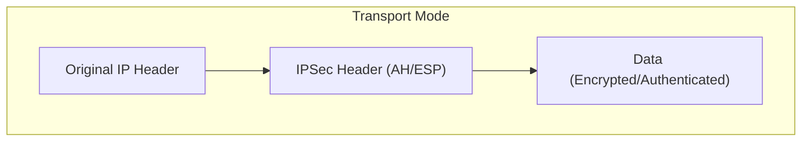
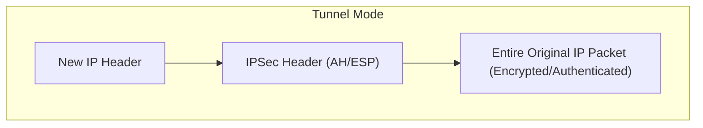

import ProblemAnswer from "@/app/components/ProblemAnswer";

export const metadata = {
  title: "🔒 A Complete Guide to IPSec: AH, ESP, and Transport/Tunnel Modes",
  description:
    "Explore everything about IPSec, the core network security protocol. Clearly understand the differences between AH and ESP, and the operational methods of Transport Mode and Tunnel Mode. Test your knowledge with practice questions for certification exams.",
  publishedAt: "2025-07-07",
  lastModifiedAt: "2025-07-07",
  timeToRead: 0,
  tags: ["Security", "Network", "IPSec", "AH", "ESP", "VPN", "InfoSec"],
  heroImage: "/contents/default.jpg",
};

## 🤔 What is IPSec?

**IPSec (Internet Protocol Security)** is a suite of protocols that secures communications by **encrypting and authenticating IP packets** at the network layer (IP layer). In simple terms, it's a safety mechanism that prevents eavesdropping, data tampering, and impersonation when exchanging data over the internet.

It is primarily used to implement VPNs (Virtual Private Networks) and plays a crucial role behind the scenes in ensuring our safe use of the internet.

---

## ⚙️ Core Components of IPSec: AH and ESP

IPSec provides security using two main protocols: **AH** and **ESP**. These two differ in the security features they offer and can be used selectively or together as needed.

### 🛡️ 1. AH (Authentication Header)

As its name suggests, **AH** is a protocol that focuses on **authentication**. It ensures data integrity (that the data has not been altered in transit) and authenticates the sender.

- **Key Features**:
  - **Data Integrity**: Ensures that data has not been tampered with.
  - **Sender Authentication**: Verifies that the source IP address of the packet is not forged.
  - **Anti-replay Protection**: Uses sequence numbers to prevent the same packet from being retransmitted.
- **Limitation**:
  - **No Encryption**: It does not hide the content of the data, making it unsuitable for communications requiring confidentiality.

> **How AH Works 🔍**
>
> AH authenticates the entire IP packet, including the IP header and the transport layer (TCP/UDP) header. This ensures the integrity of not only the packet's content but also its source and destination addresses.

### 🔐 2. ESP (Encapsulating Security Payload)

**ESP** focuses on ensuring **confidentiality** through **encryption**. Of course, it can also optionally provide data integrity and sender authentication, similar to AH.

- **Key Features**:
  - **Confidentiality (Encryption)**: Protects the content by encrypting the IP payload (the actual data part).
  - **Data Integrity (Optional)**: Ensures that data has not been tampered with.
  - **Sender Authentication (Optional)**: Authenticates the sender.
  - **Anti-replay Protection**: Uses sequence numbers.

> **AH vs. ESP: The Key Difference**
>
> - **AH**: "This letter is indeed from A, and no one has opened it in the middle." (The content is visible)
> - **ESP**: "This letter is in a secret box, so you can't see the content. Sender verification is also possible if you want." (Content is hidden)
>
> Therefore, **if confidentiality is important, you must use ESP**.

---

## 🚚 Two Modes of IPSec Operation: Transport Mode and Tunnel Mode

IPSec operates in two modes depending on the scope of data protection: **Transport Mode** and **Tunnel Mode**.

### 1. Transport Mode

**Transport Mode** is a method that protects **only the payload** of an IP packet. The original IP header is left intact, and only the data portion that follows is encrypted or authenticated.

- **Protected Target**: IP Payload (TCP/UDP data)
- **IP Header**: Uses the original IP header (source and destination addresses are unchanged)
- **Primary Use Case**: Used to protect communication between two hosts (End-to-End). (e.g., direct communication between my computer and a company server)

### 2. Tunnel Mode

**Tunnel Mode** is a method that protects the **entire IP packet**. The entire original IP packet is placed inside a new IP packet, and an IPSec header is added to this new packet. It's like putting the original letter into a new, secure envelope before sending it.

- **Protected Target**: The entire IP packet (original IP header + payload)
- **IP Header**: Uses a new IP header (the source and destination change to the gateways)
- **Primary Use Case**: Primarily used to protect communication between two networks (Site-to-Site), i.e., between VPN gateways.

> ### VPN and IPSec: How is a Secure Tunnel Created?
>
> A VPN (Virtual Private Network) is a technology that allows secure communication over a public network (mainly the internet) as if it were a private, dedicated line. IPSec is the core technology that implements this VPN, playing the role of creating a 'secure tunnel' for safe data transmission.
>
> Let's take a closer look at how IPSec is used in a VPN.
>
> 1.  **Using Tunnel Mode**: VPNs primarily use IPSec's **Tunnel Mode**. This is used for site-to-site VPNs (connecting headquarters to a branch office) or for remote access VPNs (when a remote employee connects to the company network).
>
> 2.  **Packet Encapsulation**: Let's say a user's computer sends data to a company's internal server. The source of this data packet will be 'my computer's IP', and the destination will be 'the company server's IP'. Before this packet goes out to the internet, the VPN gateway (e.g., a home router or a company firewall) **puts the entire original IP packet into a new IP packet.** This is 'encapsulation'.
>
> 3.  **Adding a New IP Header**: A new IP header is attached to the encapsulated new packet. The source of this new header becomes 'the home router's IP', and the destination becomes 'the company firewall's IP'. This means that on the internet, it only appears as communication between the two VPN gateways. The original source and destination IPs are hidden and encrypted.
>
> 4.  **Encryption and Authentication (ESP/AH)**:
>     -   The **ESP (Encapsulating Security Payload)** protocol is used to encrypt the entire encapsulated original IP packet. This ensures that even if a hacker intercepts the data as it passes through the internet, they cannot read its contents (confidentiality).
>     -   The **AH (Authentication Header)** or ESP's authentication feature is used to ensure that the packet has not been tampered with during transmission (integrity) and to verify that the packet truly came from the trusted counterpart VPN gateway (authentication).
>
> 5.  **Tunneling and Decryption**: The securely packaged packet is then transmitted through the public network, the internet, as if through a 'tunnel' to the counterpart VPN gateway. The receiving gateway uses IPSec to decrypt the packet, removes the outer IP header to retrieve the original IP packet, and then safely delivers this original packet to its final destination, the internal server.
>
> **In conclusion, IPSec plays a crucial role for VPNs by creating an 'encrypted virtual pathway' over the public internet, allowing two distant points to communicate securely as if they were on the same internal network.**

### 📊 Transport Mode vs. Tunnel Mode Comparison

| Category        | **Transport Mode**              | **Tunnel Mode**                     |
| :-------------- | :------------------------------ | :---------------------------------- |
| **Scope**       | Protects only the IP payload    | Protects the entire IP packet       |
| **IP Header**   | Maintains the original IP header| Adds a new IP header                |
| **Primary Use** | Host-to-host (End-to-End)       | Network-to-network (Site-to-Site VPN) |
| **Security**    | Lower (IP header exposed)       | Higher (Entire packet protected)    |

---

## 📝 Practice Questions for Certification Exams

<ProblemAnswer
  problem="What is the communication protocol at the IP layer (Layer 3) that uses an Authentication Header (AH) for integrity and authentication, and Encapsulating Security Payload (ESP) for confidentiality?"
  correctAnswer="IPSec"
/>

<ProblemAnswer
  problem="Which component of IPSec provides data integrity and sender authentication but does not offer encryption?"
  correctAnswer="AH (Authentication Header)"
/>

<ProblemAnswer
  problem="Which component of IPSec ensures data confidentiality (encryption) and can optionally provide authentication and integrity?"
  correctAnswer="ESP (Encapsulating Security Payload)"
/>

<ProblemAnswer
  problem="Which mode of IPSec operation protects only the IP payload and leaves the original IP header intact?"
  correctAnswer="Transport Mode"
/>

<ProblemAnswer
  problem="Which mode of IPSec operation protects the entire original IP packet by encapsulating it within a new IP packet, and is primarily used for communication between VPN gateways?"
  correctAnswer="Tunnel Mode"
/>
