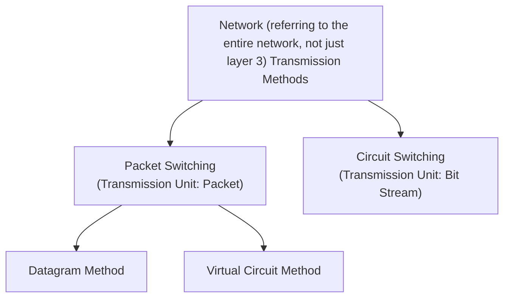

export const metadata = {
  title: "Network Transmission Methods: Packet Switching vs Circuit Switching",
  description:
    "Explains the characteristics and differences between the two main data transmission methods in networks: packet switching and circuit switching. Provides a comparative analysis of datagram and virtual circuit methods in packet switching, as well as the differences between connectionless and connection-oriented communication.",
  publishedAt: "2025-06-26",
  lastModifiedAt: "2025-06-26",
  timeToRead: 0,
  heroImage: "/contents/default.jpg",
  tags: [
    "Network",
    "Packet Switching",
    "Circuit Switching",
    "Datagram",
    "Virtual Circuit",
    "Computer Network",
  ],
};

- There are two types of network (referring to the entire network, not just layer 3) transmission methods.
- Packet Switching: Transmission unit is packets
- Circuit Switching: Transmission unit is continuous bit streams

## Circuit Switching

- **Transmission Unit**: Continuous bit stream
- **Connection Method**: Establishes a dedicated circuit between sender and receiver before communication
- **Operating Layers**: Sets up and manages circuits at the physical layer (Layer 1 - bit units) and data link layer (Layer 2 - frame units)
- **Characteristics**: Once a circuit is established, it is used exclusively until communication ends
- **Advantages**: Guaranteed constant bandwidth, predictable delay time
- **Disadvantages**: Circuit utilization may be low, setup time required
- **Example**: Traditional telephone system (PSTN)

## Packet Switching

- **Transmission Unit**: Packets
- **Connection Method**: Divides data into packet units and transmits each independently
- **Operating Layer**: Processes packets and performs routing at the network layer (Layer 3)
- **Characteristics**: Each packet can be transmitted through different paths
- **Advantages**: High circuit efficiency, multi-user support
- **Disadvantages**: Possibility of packet loss, variable delay time

### Datagram Method

- Transmits independent packets along with headers
- Connectionless switching method

### Virtual Circuit Method

- Sets up a logical circuit and transmits packets
- Connection-oriented switching method

## Connectionless vs Connection-oriented Comparison

| Category                 | Connectionless (Datagram) | Connection-oriented (Virtual Circuit) |
| ------------------------ | ------------------------- | ------------------------------------- |
| Connection Setup         | Not required              | Required                              |
| Packet Independence      | Independent               | Dependent                             |
| Path Determination       | Different for each packet | Fixed path                            |
| Order Guarantee          | Not guaranteed            | Guaranteed                            |
| Representative Protocols | IP, UDP                   | ATM, X.25                             |
