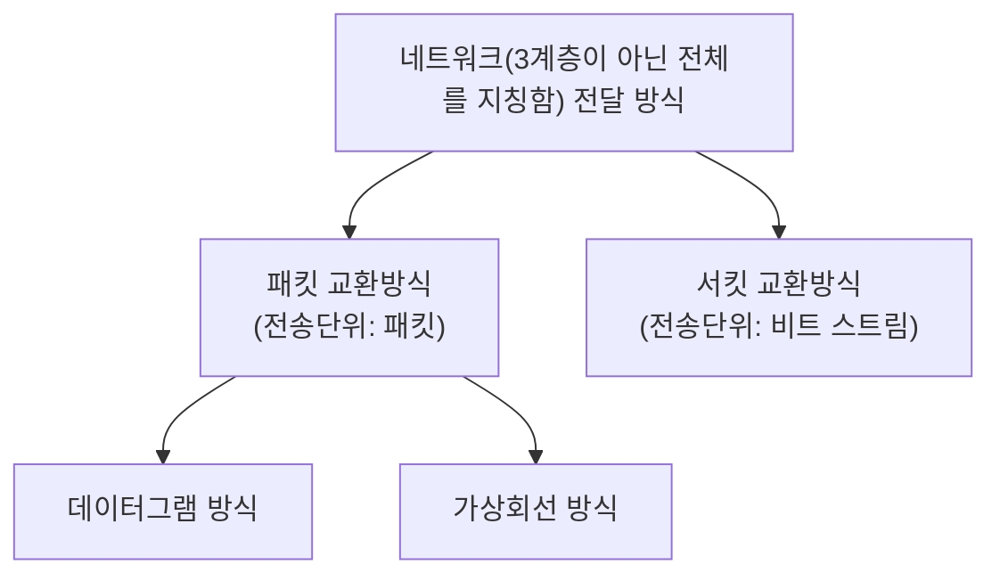

export const metadata = {
  title: "네트워크 전송 방식: 패킷 교환 vs 서킷 교환",
  description:
    "네트워크에서 데이터를 전송하는 두 가지 주요 방식인 패킷 교환과 서킷 교환의 특징과 차이점을 설명합니다. 패킷 교환 방식의 데이터그램과 가상회선 방식, 그리고 비연결형과 연결형 통신의 차이점을 비교 분석합니다.",
  publishedAt: "2025-06-26",
  lastModifiedAt: "2025-06-26",
  timeToRead: 0,
  heroImage: "/contents/default.jpg",
  tags: [
    "네트워크",
    "패킷교환",
    "서킷교환",
    "데이터그램",
    "가상회선",
    "컴퓨터네트워크",
  ],
};

- 네트워크(3계층이 아닌 전체를 지칭함) 전달 방식에는 2가지가 존재한다.
- 패킷 교환 방식: 전송단위는 패킷
- 서킷 교환 방식: 전송단위는 연속적인 비트 스트림

## 서킷 교환 방식 (Circuit Switching)

- **전송 단위**: 연속적인 비트 스트림
- **연결 방식**: 통신 전에 송신자와 수신자 간에 전용 회선을 설정
- **동작 계층**: 물리 계층(1계층-비트 단위)과 데이터 링크 계층(2계층-프레임 단위)에서 회선을 설정하고 관리
- **특징**: 한번 회선이 설정되면 통신이 끝날 때까지 해당 회선을 독점적으로 사용
- **장점**: 일정한 대역폭 보장, 지연 시간 예측 가능
- **단점**: 회선 이용률이 낮을 수 있음, 설정 시간 필요
- **예시**: 전통적인 전화 시스템 (PSTN)

## 패킷 교환 방식 (Packet Switching)

- **전송 단위**: 패킷
- **연결 방식**: 데이터를 패킷 단위로 나누어 각각 독립적으로 전송
- **동작 계층**: 네트워크 계층(3계층)에서 패킷을 처리하고 라우팅
- **특징**: 각 패킷이 서로 다른 경로를 통해 전송될 수 있음
- **장점**: 회선 효율성 높음, 다중 사용자 지원
- **단점**: 패킷 손실 가능성, 지연 시간 변동

### 데이터그램 방식

- 독립적인 패킷을 헤더와 함께 전송하는 방식
- 비연결형 교환 방식

### 가상회선 방식

- 논리적인 회선을 설정하고 패킷을 전송하는 방식
- 연결형 교환 방식

## 비연결형 vs 연결형 비교

| 구분          | 비연결형 (데이터그램) | 연결형 (가상회선) |
| ------------- | --------------------- | ----------------- |
| 연결 설정     | 불필요                | 필요              |
| 패킷 독립성   | 독립적                | 종속적            |
| 경로 결정     | 패킷마다 다름         | 고정 경로         |
| 순서 보장     | 보장 안됨             | 보장됨            |
| 대표 프로토콜 | IP, UDP               | ATM, X.25         |
