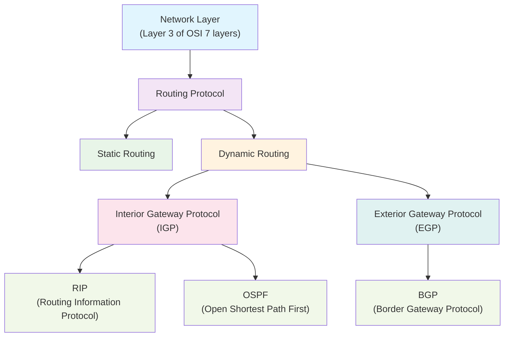

export const metadata = {
  title:
    "Complete Guide to Network Routing Protocols: Everything About IGP and EGP",
  description:
    "A systematic overview of routing protocols in the network layer. This guide covers the differences between static and dynamic routing, the distinction between Interior Gateway Protocols (IGP) and Exterior Gateway Protocols (EGP), and detailed characteristics and algorithms of RIP, OSPF, and BGP based on the concept of Autonomous Systems (AS).",
  publishedAt: "2025-06-26",
  lastModifiedAt: "2025-06-26",
  timeToRead: 0,
  heroImage: "/contents/default.jpg",
  tags: [
    "Network",
    "Routing",
    "Protocol",
    "IGP",
    "EGP",
    "OSI",
    "BGP",
    "OSPF",
    "RIP",
    "Autonomous System",
    "Network Security",
    "Internet",
  ],
};

- Starting from the network layer (OSI layer 3)
- Routing protocols are classified into static routing and dynamic routing
- Dynamic routing is further divided into Interior Gateway Protocols (IGP) and Exterior Gateway Protocols (EGP)
- IGP includes RIP and OSPF, while EGP includes BGP

## Keywords

### Routing

Routing refers to the process of establishing paths for data transmission in the network layer.

### Static Routing vs Dynamic Routing

- Static Routing - A method that predefines paths during router configuration and uses fixed routes.
- Dynamic Routing - A method that automatically calculates paths during router configuration and dynamically changes routes.

### Interior Gateway Protocol (IGP) vs Exterior Gateway Protocol (EGP)

- Interior Gateway Protocol (IGP) - Routing protocol used within the same network.
- Exterior Gateway Protocol (EGP) - Routing protocol used between different networks.

<strong>Criteria for Distinguishing Same Network vs Different Networks</strong>

## Autonomous System (AS)

The most important distinction criterion is the **Autonomous System (AS)**.

- **Same Network (Same AS)**: Network domain managed by a single organization or institution
- **Different Network (Different AS)**: Network domains managed by different organizations or institutions

### Management Authority Criteria

- **Same Network**: Domain controlled by the same network administrator or organization
- **Different Network**: Networks operated by different management entities

### Specific Examples

#### Same Network (IGP Usage)

- Multiple departmental networks within a company
- Networks of different buildings within a university campus

#### Different Networks (EGP Usage)

- Networks of different telecommunications companies like KT and SKT
- Internet connections between Korea and the United States
- Connections between different ISPs (Internet Service Providers)

#### Distinction by AS Numbers

Each autonomous system has a unique **AS number**:

- AS 1 ~ AS 65535: Public AS numbers
- Examples: KT (AS 4766), SKT (AS 9318), Google (AS 15169)

### Interior Gateway Protocol (IGP)

#### RIP (Routing Information Protocol)

- Uses **Distance Vector Algorithm - Bellman-Ford Algorithm**
- Each router receives distance information from neighboring routers to update routing table
- Supports up to 15 hops based on hop count

#### OSPF (Open Shortest Path First)

- Uses **Link State Algorithm - Dijkstra Algorithm**
- Each router calculates shortest path after understanding entire network topology
- Suitable for large-scale networks with fast convergence characteristics

### Exterior Gateway Protocol (EGP)

#### BGP (Border Gateway Protocol)

- Uses **Path Vector Algorithm**
- Exchanges complete AS path information to destinations
- Core protocol used in internet backbone

## Routing Algorithm Comparison

### Distance Vector vs Link State vs Path Vector

| Category                    | Distance Vector      | Link State        | Path Vector          |
| --------------------------- | -------------------- | ----------------- | -------------------- |
| **Representative Protocol** | RIP                  | OSPF              | BGP                  |
| **Information Exchanged**   | Distance (hop count) | Complete topology | Complete path        |
| **Algorithm**               | Bellman-Ford         | Dijkstra          | Path Vector          |
| **Usage Scope**             | Small networks       | Large networks    | Inter-AS connections |
