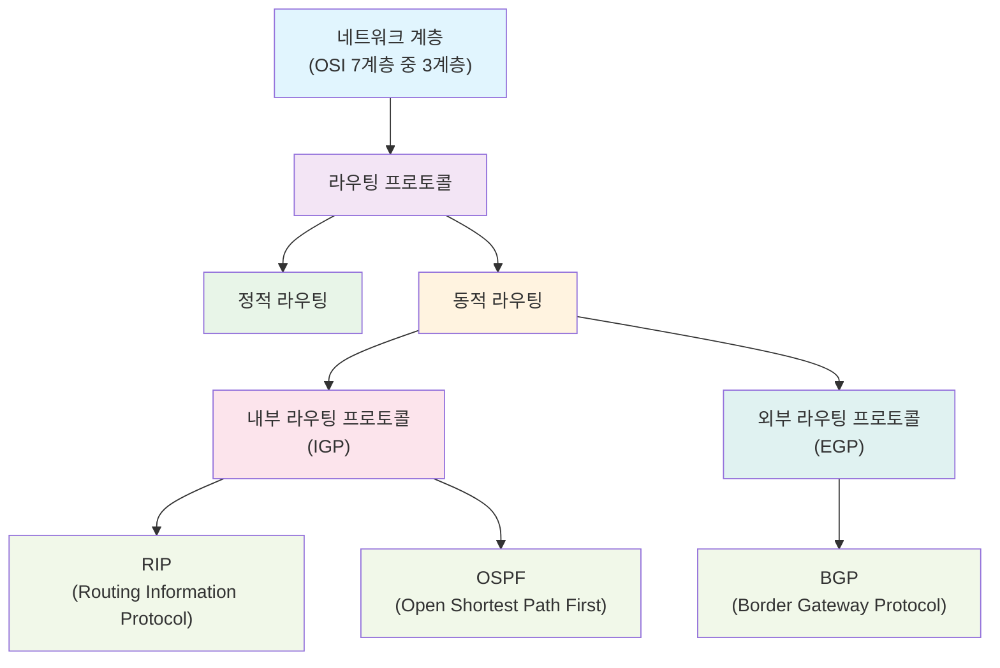

export const metadata = {
  title: "네트워크 라우팅 프로토콜 완전 정리: IGP와 EGP의 모든 것",
  description:
    "네트워크 계층의 라우팅 프로토콜을 체계적으로 정리했다. 정적 라우팅과 동적 라우팅의 차이점, 내부 라우팅 프로토콜(IGP)과 외부 라우팅 프로토콜(EGP)의 구분, 자율 시스템(AS) 개념을 바탕으로 RIP, OSPF, BGP의 특징과 알고리즘을 상세히 다룬다.",
  publishedAt: "2025-01-27",
  lastModifiedAt: "2025-01-27",
  timeToRead: 0,
  heroImage: "/contents/default.jpg",
  tags: [
    "네트워크",
    "라우팅",
    "프로토콜",
    "IGP",
    "EGP",
    "OSI",
    "BGP",
    "OSPF",
    "RIP",
    "자율시스템",
    "네트워크보안",
    "인터넷",
  ],
};

- 네트워크 계층(OSI 3계층)에서 시작하여
- 라우팅 프로토콜이 정적 라우팅과 동적 라우팅으로 분류되고
- 동적 라우팅이 다시 내부 라우팅 프로토콜(IGP)과 외부 라우팅 프로토콜(EGP)로 나뉘며
- IGP에는 RIP과 OSPF가, EGP에는 BGP가 포함

## 키워드

### 라우팅

라우팅은 네트워크 계층에서 데이터를 전송하기 위해 경로를 설정하는 과정을 의미한다.

### 정적 라우팅 vs 동적 라우팅

- 정적 라우팅 - 라우터 설정 시 미리 경로를 정의하고 고정된 경로를 사용하는 방식이다.
- 동적 라우팅 - 라우터 설정 시 경로를 자동으로 계산하고 동적으로 경로를 변경하는 방식이다.

### 내부 라우팅 프로토콜(IGP) vs 외부 라우팅 프로토콜(EGP)

- 내부 라우팅 프로토콜(IGP) - 같은 네트워크 내에서 사용되는 라우팅 프로토콜이다.
- 외부 라우팅 프로토콜(EGP) - 다른 네트워크 간에 사용되는 라우팅 프로토콜이다.

<strong>같은 네트워크와 다른 네트워크의 구분 기준</strong>

## 자율 시스템(AS, Autonomous System)

가장 중요한 구분 기준은 **자율 시스템(AS)**이다.

- **같은 네트워크 (같은 AS)**: 하나의 조직이나 기관이 관리하는 네트워크 영역
- **다른 네트워크 (다른 AS)**: 서로 다른 조직이나 기관이 관리하는 네트워크 영역

### 관리 주체 기준

- **같은 네트워크**: 동일한 네트워크 관리자나 조직이 제어하는 영역
- **다른 네트워크**: 서로 다른 관리 주체가 운영하는 네트워크

### 구체적인 예시

#### 같은 네트워크 (IGP 사용)

- 한 회사 내부의 여러 부서 네트워크
- 대학교 캠퍼스 내의 각 건물별 네트워크

#### 다른 네트워크 (EGP 사용)

- KT와 SKT 같은 서로 다른 통신사 네트워크
- 한국과 미국의 인터넷 연결
- 서로 다른 ISP(인터넷 서비스 제공업체) 간 연결

#### AS 번호로 구분

각 자율 시스템은 고유한 **AS 번호**를 가진다:

- AS 1 ~ AS 65535: 공인 AS 번호
- 예: KT(AS 4766), SKT(AS 9318), 구글(AS 15169)

### 내부 라우팅 프로토콜(IGP)

#### RIP (Routing Information Protocol)

- **거리 벡터 알고리즘 - 벨만-포드 알고리즘** 사용
- 각 라우터가 인접 라우터로부터 거리 정보를 받아 라우팅 테이블 업데이트
- 홉 카운트를 기준으로 최대 15홉까지 지원

#### OSPF (Open Shortest Path First)

- **링크 상태 알고리즘 - 다익스트라 알고리즘** 사용
- 각 라우터가 전체 네트워크 토폴로지를 파악한 후 최단 경로 계산
- 대규모 네트워크에 적합하며 빠른 수렴 특성

### 외부 라우팅 프로토콜(EGP)

#### BGP (Border Gateway Protocol)

- **경로 벡터 알고리즘** 사용
- 목적지까지의 전체 AS 경로 정보를 교환
- 인터넷 백본에서 사용되는 핵심 프로토콜

## 라우팅 알고리즘 비교

### 거리 벡터 vs 링크 상태 vs 경로 벡터

| 구분              | 거리 벡터       | 링크 상태       | 경로 벡터  |
| ----------------- | --------------- | --------------- | ---------- |
| **대표 프로토콜** | RIP             | OSPF            | BGP        |
| **교환 정보**     | 거리(홉 수)     | 전체 토폴로지   | 전체 경로  |
| **알고리즘**      | 벨만-포드       | 다익스트라      | 경로 벡터  |
| **사용 범위**     | 소규모 네트워크 | 대규모 네트워크 | AS 간 연결 |
