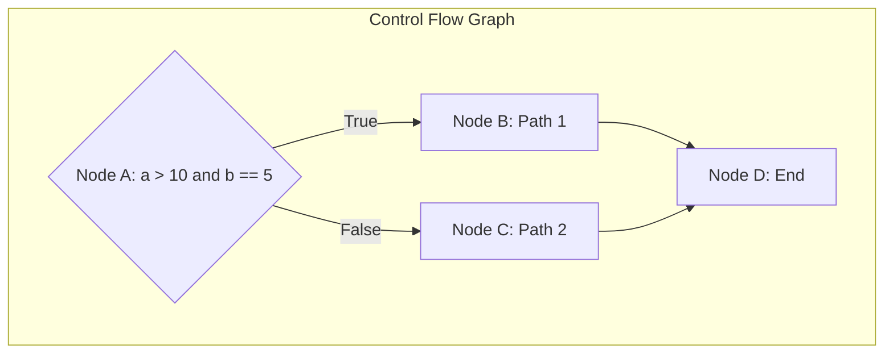
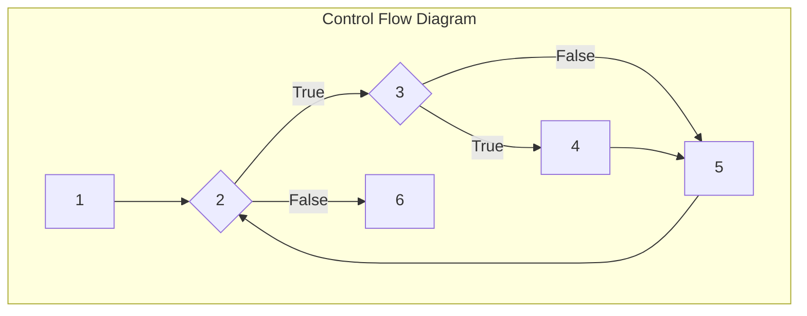

import ProblemAnswer from "@/app/components/ProblemAnswer";

export const metadata = {
  title: "🧪 Test Coverage: Statement, Decision, Condition, MC/DC | 🚀 For Engineer Exam",
  description:
    "Learn the core concepts of software test coverage (Statement, Decision, Condition, Condition/Decision, MC/DC) and prepare perfectly with past questions from the Information Processing Engineer practical exam.",
  publishedAt: "2025-07-10",
  lastModifiedAt: "2025-07-10",
  timeToRead: 0,
  tags: ["Engineer Exam", "Software Testing", "Test Coverage", "White Box Testing"],
  heroImage: "/contents/default.jpg",
};

> 💡 Multiple-choice questions for the Information Processing Engineer practical exam are at the end of this post. It's important to read the description and identify which coverage it is.

In software testing, **test coverage** is a metric that indicates how thoroughly a test has verified the source code. While high coverage does not necessarily guarantee high quality, it plays a crucial role in identifying areas with insufficient testing and increasing the reliability of tests.

Understanding the various coverage criteria used, especially in white-box testing, is a key concept frequently featured in the Information Processing Engineer exam.

## 📊 Summary of Test Coverage Types

Test coverage is a measure of test sufficiency, with various types depending on the structural complexity of the code. There is a hierarchical relationship between coverages, with MC/DC generally considered the strongest criterion.

**Coverage Strength:** Statement < Decision < Condition < Condition/Decision < Modified Condition/Decision (MC/DC)

| Coverage Type               | **English Name**                                | **Core Keywords**                        | **Description**                                                                                                                 |
| :-------------------------- | :------------------------------------------- | :------------------------------------- | :----------------------------------------------------------------------------------------------------------------------- |
| **Statement Coverage**     | Statement Coverage                           | `All statements`, `executed at least once`       | A criterion that tests whether every executable statement in the code is executed at least once.                                                 |
| **Decision (Branch) Coverage**     | Decision / Branch Coverage                   | `All decision points`, `true/false`, `at least once` | A criterion that tests whether every branch (e.g., if, switch) has taken both true and false outcomes.                            |
| **Condition Coverage**           | Condition Coverage                           | `Within a decision`, `each condition`, `true/false`    | A criterion that tests whether each individual condition in a decision statement has been evaluated as both true and false.                          |
| **Condition/Decision Coverage**      | Condition/Decision Coverage                  | `Condition` + `Decision` coverage satisfied     | A criterion that satisfies both decision coverage and condition coverage.                                           |
| **Modified Condition/Decision Coverage** | Modified Condition/Decision Coverage (MC/DC) | `Each condition`, `independent effect`           | A criterion that tests whether each individual condition independently affects the outcome of the decision, regardless of other conditions. |

---

## 1. Statement Coverage

**Statement coverage** is the most basic coverage criterion, measuring whether every executable statement in the source code has been executed at least once.

- **Pros**: Easy to understand and straightforward to create test cases for.
- **Cons**: May not test all logical branches in the code.

- **Example Code**:

```java
public void example(int x) {
    if (x > 0) { // Decision
        System.out.println("Positive"); // Statement 1
    }
    System.out.println("End"); // Statement 2
}
```

- **100% Coverage Test Case**: `x = 5`
- This test case only tests the true path of the `if` statement, but since it executes both `Statement 1` and `Statement 2`, it satisfies 100% statement coverage. The case where `x` is less than or equal to 0 is not tested.

---

## 2. Decision/Branch Coverage

**Decision coverage** is a criterion that tests whether the outcome of every decision point (if, switch, for, while, etc.) has been both True and False at least once. It is considered stronger than statement coverage.

- **Pros**: Can test branch paths missed by statement coverage.
- **Cons**: Does not test all combinations within complex conditional expressions.

- **Example Code**:

```java
public void example(int x, int y) {
    if (x > 0 && y > 0) { // Decision
        System.out.println("Both Positive");
    }
}
```

- **100% Coverage Test Cases**:
  1. `x = 5, y = 5` (Decision outcome: True)
  2. `x = -1, y = 5` (Decision outcome: False)
- These two cases cover both the true and false outcomes of the decision, thus satisfying 100% decision coverage.

---

## 3. Condition Coverage

**Condition coverage** is a criterion that tests whether **each individual condition** within a decision statement has been evaluated as both True and False at least once.

- **Note**: Condition coverage does not consider the overall outcome (true/false) of the decision statement. This can lead to situations where it does not satisfy 100% decision coverage.

- **Example Code**:

```java
public void example(int x, int y) {
    // Decision: (x > 0 && y > 0)
    // Condition 1: x > 0
    // Condition 2: y > 0
    if (x > 0 && y > 0) {
        System.out.println("Both Positive");
    }
}
```

- **100% Coverage Test Cases**:
  1. `x = 5, y = -5` (Condition 1: True, Condition 2: False)
  2. `x = -5, y = 5` (Condition 1: False, Condition 2: True)
- These two cases ensure that each condition has been both true and false, satisfying 100% condition coverage. However, the overall decision outcome is always false, so decision coverage is only 50%.

---

## 4. Condition/Decision Coverage

**Condition/Decision coverage** is a testing criterion that satisfies both **decision coverage** and **condition coverage** at 100%. This means test cases must be designed so that the outcome of every decision point is both true and false at least once, and simultaneously, the outcome of every individual condition is also both true and false at least once.

- **Pros**: Increases test reliability by satisfying both decision and condition levels.
- **Cons**: Does not test all combinations of conditions, making it less rigorous than MC/DC.

- **Example Code**:

```java
public void example(int x, int y) {
    // Decision: (x > 0 && y > 0)
    // Condition 1: x > 0
    // Condition 2: y > 0
    if (x > 0 && y > 0) {
        System.out.println("Both Positive");
    }
}
```

- **100% Coverage Test Cases**:

  1. `x = 5, y = 5`
     - Condition 1: True, Condition 2: True
     - Decision outcome: True
  2. `x = -5, y = -5`
     - Condition 1: False, Condition 2: False
     - Decision outcome: False

- **Analysis**:
  - **Decision Coverage**: The decision outcome is both true and false, so it's 100% satisfied.
  - **Condition Coverage**: Condition 1 (`x>0`) and Condition 2 (`y>0`) are both evaluated as true and false, so it's 100% satisfied.

---

## 5. Modified Condition/Decision Coverage (MC/DC)

**MC/DC** is a very strong criterion that satisfies both condition and decision coverage, and also tests cases where **each individual condition independently affects the outcome of the overall decision, regardless of the values of other conditions**. It is primarily used in systems requiring high reliability, such as aviation, nuclear power, and medical devices.

- **Key**: Each condition must be proven to 'independently' affect the outcome.

- **Example Code**:

```java
public void example(boolean A, boolean B, boolean C) {
    // Decision: (A || B) && C
    if ((A || B) && C) {
        System.out.println("Success");
    }
}
```

- **100% Coverage Test Cases (Partial)**:
  - **Prove A's independent effect**: Fix B as False and C as True, then change A to see if the overall result changes.
    - `A=T, B=F, C=T` -> Result: True
    - `A=F, B=F, C=T` -> Result: False
  - **Prove B's independent effect**: Fix A as False and C as True, then change B to see if the overall result changes.
    - `A=F, B=T, C=T` -> Result: True
    - `A=F, B=F, C=T` -> Result: False
  - **Prove C's independent effect**: Fix (A || B) to be True (e.g., A=T, B=F), then change C to see if the overall result changes.
    - `A=T, B=F, C=T` -> Result: True
    - `A=T, B=F, C=F` -> Result: False

---

## 📝 Comprehensive Problems for the Engineer Exam

Look at the code and control flow graph below, and choose the test case combination from the options that satisfies 100% of each test coverage.

### Target Code and Control Flow Graph

```java
public void check(int a, int b) {
    // Node A (Decision)
    if (a > 10 && b == 5) {
        // Node B
        System.out.println("Path 1");
    } else {
        // Node C
        System.out.println("Path 2");
    }
    // Node D
    System.out.println("End");
}
```



## Problem 1

> **Options:**
>
> 1. "TC1: (a=20, b=5)"
> 2. "TC1: (a=5, b=1), TC2: (a=1, b=5)"
> 3. "TC1: (a=20, b=5), TC2: (a=5, b=5)"
> 4. "TC1: (a=15, b=5), TC2: (a=30, b=5)"

<ProblemAnswer
  problem="Which of the following test case combinations satisfies 100% statement coverage?"
  correctAnswer={`
**Answer: 3**

**Explanation:**
Statement coverage requires that every executable statement (Nodes A, B, C, D) is executed at least once.

- **Option 3**'s "TC1(a=20, b=5)" executes the A(True) → B → D path, and "TC2(a=5, b=5)" executes the A(False) → C → D path. This combination executes all nodes, satisfying 100% statement coverage.
- **Option 1** only executes the A → B → D path, missing Node C.
- **Option 2** only executes the A → C → D path, missing Node B.
- **Option 4** executes the A → B → D path twice, missing Node C.
  `}
  />

### Problem 2

> **Options:**
>
> 1. "TC1: (a=5, b=1), TC2: (a=1, b=1)"
> 2. "TC1: (a=20, b=5), TC2: (a=5, b=1)"
> 3. "TC1: (a=15, b=5), TC2: (a=30, b=5)"
> 4. "TC1: (a=5, b=5), TC2: (a=1, b=1)"

<ProblemAnswer
  problem="Which of the following test case combinations satisfies 100% decision (branch) coverage?"
  correctAnswer={`
**Answer: 2**

**Explanation:**
Decision coverage requires that the outcome of the decision statement (Node A) is both true and false at least once.

- **Option 2**'s "TC1(a=20, b=5)" makes the decision outcome **True**. "TC2(a=5, b=1)" makes the decision outcome **False** because "b==5" is false. Thus, it satisfies both true/false outcomes.
- **Option 1** makes the decision outcome false in both cases.
- **Option 3** makes the decision outcome true in both cases.
- **Option 4** makes the decision outcome false in both cases.
  `}
  />

### Problem 3

> **Options:**
>
> 1. "TC1: (a=20, b=5), TC2: (a=5, b=5)"
> 2. "TC1: (a=5, b=1), TC2: (a=1, b=2)"
> 3. "TC1: (a=20, b=1), TC2: (a=5, b=5)"
> 4. "TC1: (a=20, b=5), TC2: (a=15, b=5)"

<ProblemAnswer
  problem="Which of the following test case combinations satisfies 100% condition coverage?"
  correctAnswer={`
**Answer: 3**

**Explanation:**
Condition coverage requires that each individual condition ("a > 10", "b == 5") is evaluated as both true and false at least once.

- **Condition 1:** "a > 10"
- **Condition 2:** "b == 5"

Let's analyze **Option 3**.

- "TC1(a=20, b=1)": Condition 1 is **True**, Condition 2 is **False**
- "TC2(a=5, b=5)": Condition 1 is **False**, Condition 2 is **True**

This combination ensures that both Condition 1 and Condition 2 experience both true/false outcomes, thus satisfying 100% condition coverage.

- **Option 1** does not test the case where Condition 2 ("b==5") is false.
- **Option 2** does not test the cases where Condition 1 ("a>10") is true and Condition 2 ("b==5") is true.
- **Option 4** does not test the cases where Condition 1 ("a>10") is false and Condition 2 ("b==5") is false.
  `}
  />

---

### Description Problems

<ProblemAnswer
  problem="What is the coverage that combines test cases to execute every statement at least once?"
  correctAnswer="Statement Coverage"
/>

<ProblemAnswer
  problem="What is the coverage that combines test cases so that each decision has a true and false outcome at least once?"
  correctAnswer="Decision/Branch Coverage"
/>

<ProblemAnswer
  problem="What is the coverage that combines test cases so that each condition within a decision has a true and false outcome at least once?"
  correctAnswer="Condition Coverage"
/>

<ProblemAnswer
  problem="What is the coverage that combines test cases to satisfy both 100% decision coverage and 100% condition coverage?"
  correctAnswer="Condition/Decision Coverage"
/>

<ProblemAnswer
  problem="Write the name of the testing technique described below. A test coverage in which each individual condition independently affects the overall condition's outcome, regardless of other individual conditions."
  correctAnswer="MC/DC (Modified Condition/Decision Coverage)"
/>

---

## 👩‍💻 Practical Exam Type Problem

Solve the problem by looking at the following code and control flow diagram.

### Target Code

```java
// b[]: integer array, m: valid size of the array, x: comparison value
int Main(int b[], int m, int x) {
    int a = 0;                      // 1. Initialization
    while (a < m || b[a] < x) {     // 2. Loop condition check
        if (b[a] < 0) {             // 3. Check sign of the value
            b[a] = -b[a];           // 4. Change sign
        }
        a++;                        // 5. Increment index
    }
    return 1;                       // 6. Return
}
```

### Control Flow Diagram



<ProblemAnswer
  problem={`Problem 1 
  Write the code for each node. 
  (e.g., - 1 : int a = 0;)`}
  correctAnswer={`
1 : int a = 0;
2 : a < m || b[a] < x
3 : b[a] < 0
4 : b[a] = -b[a];
5 : a++;
6 : return 1;
`}
/>

<ProblemAnswer
  problem={`Problem 2 
  Write the statement coverage sequence.
  1 -> 2 -> (                           ) `}
  correctAnswer={`3 -> 4 -> 5 -> 2 -> 3 -> 5 -> 2 -> 6`}
/>

## ➡️ Recommended Next Post

- [Tips for the Information Processing Engineer Practical Exam 📝](/en/blog/korean-information-processing-engineer-practical-exam-strategy)
