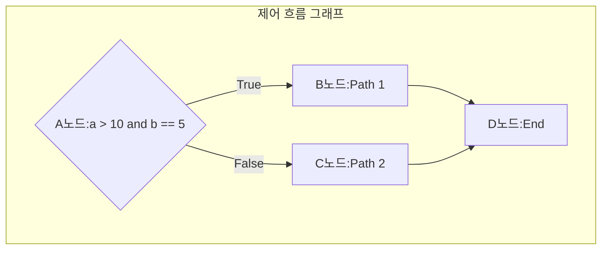
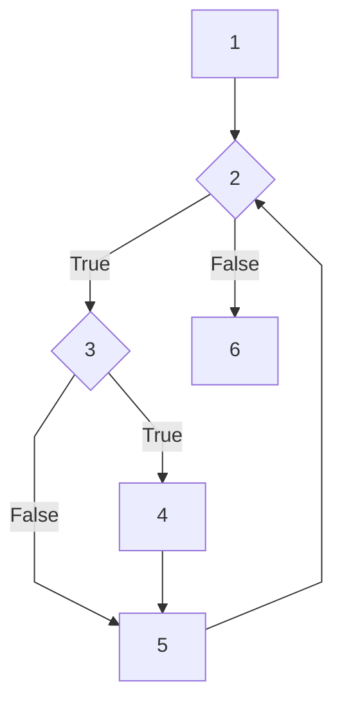
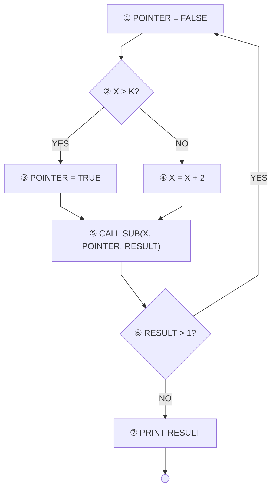

import ProblemAnswer from "@/app/components/ProblemAnswer";
import Details from "@/app/components/Details";
import TooltipLink from "@/app/components/TooltipLink";

export const metadata = {
  title: "테스트 커버리지 종류 구문(문장), 결정, 조건, MC DC - 예제",
  description:
    "소프트웨어 테스트의 핵심 개념인 테스트 커버리지(구문, 결정, 조건, 조건/결정, MC/DC)를 알아보고, 정보처리기사 실기 기출문제를 통해 완벽하게 대비합니다.",
  publishedAt: "2025-07-10",
  lastModifiedAt: "2025-07-31",
  timeToRead: 0,
  tags: ["정처기", "테스트"],
  heroImage:
    "/contents/test-coverage-for-exam/test-coverage-statement-quiz.webp",
};

> 💡 정처기 실기 대비를 위한 주관식 문제는 포스팅 마지막에 있습니다. 설명을 보고 어떤 커버리지인지 맞추는 것이 중요합니다.

소프트웨어 테스트에서 **테스트 커버리지**는 테스트가 소스 코드를 얼마나 충분히 검증했는지를 나타내는 지표입니다. 높은 커버리지가 반드시 높은 품질을 보장하는 것은 아니지만, 테스트가 부족한 부분을 식별하고 테스트의 신뢰성을 높이는 데 중요한 역할을 합니다.

특히 화이트박스 테스트에서 사용되는 다양한 커버리지 기준을 이해하는 것은 정보처리기사 시험에 자주 출제되는 핵심 개념입니다.

## 📊 테스트 커버리지 종류 요약

테스트 커버리지는 테스트의 충분성을 측정하는 기준으로, 코드의 구조적 복잡도에 따라 다양한 종류가 있습니다. 커버리지 간에는 계층적 관계가 있어, 일반적으로 MC/DC가 가장 강력한 기준으로 평가됩니다.

**커버리지 강도:** 구문 < 결정 < 조건 < 조건/결정 < 변경 조건/결정(MC/DC)

| 커버리지 종류               | **핵심 키워드**                        |
| :-------------------------- | :------------------------------------- |
| **구문(문장) 커버리지**     | `모든 명령문`, `한 번 이상 실행`       |
| **결정(분기) 커버리지**     | `모든 결정문`, `참/거짓`, `한 번 이상` |
| **조건 커버리지**           | `결정문 내`, `각 조건식`, `참/거짓`    |
| **조건/결정 커버리지**      | `조건` + `결정` 커버리지 모두 만족     |
| **변경 조건/결정 커버리지** | `개별 조건식`, `독립적 영향`           |

---

## 1. 구문(문장) 커버리지 (Statement Coverage)

**구문 커버리지**는 소스 코드의 모든 실행 가능한 문장이 적어도 한 번 이상 실행되었는지를 측정하는 가장 기본적인 커버리지 기준입니다.

- **장점**: 이해하기 쉽고 테스트 케이스를 만들기 간편합니다.
- **단점**: 코드의 논리적인 분기(branch)를 모두 테스트하지 못할 수 있습니다.

- **예시 코드**:

```java
public void example(int x) {
    if (x > 0) { // 결정문
        System.out.println("Positive"); // 문장 1
    }
    System.out.println("End"); // 문장 2
}
```

- **100% 커버리지 테스트 케이스**: `x = 5`
- 위 테스트 케이스는 `if`문의 참(true) 경로만 테스트하지만, `문장 1`과 `문장 2`를 모두 실행하므로 구문 커버리지 100%를 만족합니다. `x`가 0 이하인 경우는 테스트하지 않습니다.

---

## 2. 결정(분기) 커버리지 (Decision/Branch Coverage)

**결정 커버리지**는 모든 결정문(if, switch, for, while 등)의 결과가 참(True)과 거짓(False)을 각각 한 번 이상 갖도록 테스트하는 기준입니다. 구문 커버리지보다 강력한 기준으로 평가됩니다.

- **장점**: 구문 커버리지가 놓치는 분기 경로를 테스트할 수 있습니다.
- **단점**: 복잡한 조건식 내부의 모든 조합을 테스트하지는 못합니다.

- **예시 코드**:

```java
public void example(int x, int y) {
    if (x > 0 && y > 0) { // 결정문
        System.out.println("Both Positive");
    }
}
```

- **100% 커버리지 테스트 케이스**:
  1. `x = 5, y = 5` (결정문 결과: 참)
  2. `x = -1, y = 5` (결정문 결과: 거짓)
- 위 두 케이스는 결정문의 참/거짓 결과를 모두 포함하므로 결정 커버리지 100%를 만족합니다.

---

## 3. 조건 커버리지 (Condition Coverage)

**조건 커버리지**는 결정문 내에 있는 **각각의 개별 조건식**이 참(True)과 거짓(False)을 각각 한 번 이상 갖도록 테스트하는 기준입니다.

- **주의**: 조건 커버리지는 결정문 전체의 결과(참/거짓)는 고려하지 않습니다. 이로 인해 결정 커버리지를 100% 만족시키지 못하는 경우가 발생할 수 있습니다.

- **예시 코드**:

```java
public void example(int x, int y) {
    // 결정문: (x > 0 && y > 0)
    // 조건 1: x > 0
    // 조건 2: y > 0
    if (x > 0 && y > 0) {
        System.out.println("Both Positive");
    }
}
```

- **100% 커버리지 테스트 케이스**:
  1. `x = 5, y = -5` (조건1: 참, 조건2: 거짓)
  2. `x = -5, y = 5` (조건1: 거짓, 조건2: 참)
- 위 두 케이스는 각 조건식이 참/거짓을 모두 가지므로 조건 커버리지 100%를 만족합니다. 하지만 결정문 전체의 결과는 항상 거짓이므로, 결정 커버리지는 50%만 만족합니다.

---

## 4. 조건/결정 커버리지 (Condition/Decision Coverage)

**조건/결정 커버리지**는 **결정 커버리지**와 **조건 커버리지**를 모두 100% 만족하는 테스트 기준입니다. 즉, 모든 결정문의 결과가 참/거짓을 각각 한 번 이상 가지면서, 동시에 모든 개별 조건식의 결과도 참/거짓을 각각 한 번 이상 갖도록 테스트 케이스를 설계해야 합니다.

- **장점**: 결정과 조건 수준을 모두 만족시켜 테스트의 신뢰도를 높입니다.
- **단점**: 조건식의 모든 조합을 테스트하지는 않으므로, MC/DC보다는 강도가 약합니다.

- **예시 코드**:

```java
public void example(int x, int y) {
    // 결정문: (x > 0 && y > 0)
    // 조건 1: x > 0
    // 조건 2: y > 0
    if (x > 0 && y > 0) {
        System.out.println("Both Positive");
    }
}
```

- **100% 커버리지 테스트 케이스**:

  1. `x = 5, y = 5`
     - 조건1: 참, 조건2: 참
     - 결정문 결과: 참
  2. `x = -5, y = -5`
     - 조건1: 거짓, 조건2: 거짓
     - 결정문 결과: 거짓

- **분석**:
  - **결정 커버리지**: 결정문의 결과가 참/거짓을 모두 가지므로 100% 만족합니다.
  - **조건 커버리지**: 조건1(`x>0`)과 조건2(`y>0`)가 각각 참/거짓을 모두 가지므로 100% 만족합니다.

---

## 5. 변경 조건/결정 커버리지 (MC/DC, Modified Condition/Decision Coverage)

**MC/DC**는 조건 커버리지와 결정 커버리지를 모두 만족시키면서, **각 개별 조건식이 다른 조건식의 값과 관계없이 전체 결정문의 결과에 독립적으로 영향을 미치는** 경우를 테스트하는 매우 강력한 기준입니다. 주로 항공, 원자력, 의료 등 높은 신뢰성이 요구되는 시스템에서 사용됩니다.

- **핵심**: 각 조건이 '독립적으로' 결과에 영향을 주는 것을 증명해야 합니다.

- **예시 코드**:

```java
public void example(boolean A, boolean B, boolean C) {
    // 결정문: (A || B) && C
    if ((A || B) && C) {
        System.out.println("Success");
    }
}
```

- **100% 커버리지 테스트 케이스 (일부)**:
  - **A의 독립적 영향 증명**: B는 False, C는 True로 고정한 상태에서 A를 변경하여 전체 결과가 바뀌는지 확인합니다.
    - `A=T, B=F, C=T` -> 결과: True
    - `A=F, B=F, C=T` -> 결과: False
  - **B의 독립적 영향 증명**: A는 False, C는 True로 고정한 상태에서 B를 변경하여 전체 결과가 바뀌는지 확인합니다.
    - `A=F, B=T, C=T` -> 결과: True
    - `A=F, B=F, C=T` -> 결과: False
  - **C의 독립적 영향 증명**: (A || B)가 True가 되도록 고정한 상태(예: A=T, B=F)에서 C를 변경하여 전체 결과가 바뀌는지 확인합니다.
    - `A=T, B=F, C=T` -> 결과: True
    - `A=T, B=F, C=F` -> 결과: False

---

## 📝 정처기 실기 대비 종합 문제

아래 코드와 제어 흐름 그래프를 보고, 각 테스트 커버리지를 100% 만족하는 테스트 케이스 조합을 보기에서 고르시오.

### 대상 코드 및 제어 흐름 그래프

```java
public void check(int a, int b) {
    // 노드 A (결정문)
    if (a > 10 && b == 5) {
        // 노드 B
        System.out.println("Path 1");
    } else {
        // 노드 C
        System.out.println("Path 2");
    }
    // 노드 D
    System.out.println("End");
}
```



{/* prettier-ignore */}
<Details summary="문제 1">

## 문제 1

> **보기:**
>
> 1. "TC1: (a=20, b=5)"
> 2. "TC1: (a=5, b=1), TC2: (a=1, b=5)"
> 3. "TC1: (a=20, b=5), TC2: (a=5, b=5)"
> 4. "TC1: (a=15, b=5), TC2: (a=30, b=5)"

<ProblemAnswer
  problem="다음 보기 중 구문 커버리지를 100% 만족하는 테스트 케이스 조합은 무엇인가?"
  correctAnswer={`
**정답: 3번**

**해설:**
구문 커버리지는 모든 실행문(노드 A, B, C, D)을 한 번 이상 실행해야 합니다.

- **보기 3번**의 "TC1(a=20, b=5)"는 A(True) → B → D 경로를, "TC2(a=5, b=5)"는 A(False) → C → D 경로를 실행합니다. 이 조합은 모든 노드를 실행시키므로 100% 구문 커버리지를 만족합니다.
- **보기 1번**은 A → B → D 경로만 실행하여 노드 C를 누락합니다.
- **보기 2번**은 A → C → D 경로만 실행하여 노드 B를 누락합니다.
- **보기 4번**은 A → B → D 경로만 두 번 실행하여 노드 C를 누락합니다.
  `}
  />

</Details>

{/* prettier-ignore */}
<Details summary="문제 2">
### 문제 2

> **보기:**
>
> 1. "TC1: (a=5, b=1), TC2: (a=1, b=1)"
> 2. "TC1: (a=20, b=5), TC2: (a=5, b=1)"
> 3. "TC1: (a=15, b=5), TC2: (a=30, b=5)"
> 4. "TC1: (a=5, b=5), TC2: (a=1, b=1)"

<ProblemAnswer
  problem="다음 보기 중 결정(분기) 커버리지를 100% 만족하는 테스트 케이스 조합은 무엇인가?"
  correctAnswer={`
**정답: 2번**

**해설:**
결정 커버리지는 결정문(노드 A)의 결과가 참(True)과 거짓(False)을 각각 한 번 이상 갖도록 해야 합니다.

- **보기 2번**의 "TC1(a=20, b=5)"는 결정 결과를 **참**으로 만듭니다. "TC2(a=5, b=1)"는 "b==5"가 거짓이므로 결정 결과를 **거짓**으로 만듭니다. 따라서 참/거짓을 모두 만족시킵니다.
- **보기 1번**은 두 케이스 모두 결정 결과를 거짓으로 만듭니다.
- **보기 3번**은 두 케이스 모두 결정 결과를 참으로 만듭니다.
- **보기 4번**은 두 케이스 모두 결정 결과를 거짓으로 만듭니다.
  `}
  />
  </Details>

{/* prettier-ignore */}
<Details summary="문제 3">
### 문제 3

> **보기:**
>
> 1. "TC1: (a=20, b=5), TC2: (a=5, b=5)"
> 2. "TC1: (a=5, b=1), TC2: (a=1, b=2)"
> 3. "TC1: (a=20, b=1), TC2: (a=5, b=5)"
> 4. "TC1: (a=20, b=5), TC2: (a=15, b=5)"

<ProblemAnswer
  problem="다음 보기 중 조건 커버리지를 100% 만족하는 테스트 케이스 조합은 무엇인가?"
  correctAnswer={`
**정답: 3번**

**해설:**
조건 커버리지는 각 개별 조건식("a > 10", "b == 5")이 참과 거짓을 각각 한 번 이상 갖도록 해야 합니다.

- **조건 1:** "a > 10"
- **조건 2:** "b == 5"

**보기 3번**을 분석해 보겠습니다.

- "TC1(a=20, b=1)": 조건 1은 **참**, 조건 2는 **거짓**
- "TC2(a=5, b=5)": 조건 1은 **거짓**, 조건 2는 **참**

이 조합을 통해 조건 1과 조건 2가 각각 참/거짓을 모두 경험하므로, 100% 조건 커버리지를 만족합니다.

- **보기 1번**은 조건 2("b==5")가 거짓인 경우를 테스트하지 않습니다.
- **보기 2번**은 조건 1("a>10")이 참인 경우와 조건 2("b==5")가 참인 경우를 테스트하지 않습니다.
- **보기 4번**은 조건 1("a>10")이 거짓인 경우와 조건 2("b==5")가 거짓인 경우를 테스트하지 않습니다.
  `}
  />

</Details>

---

### 설명 문제

<ProblemAnswer
  problem="모든 명령문을 적어도 한 번 실행되도록 조합하는 커버리지는 무엇인가?"
  correctAnswer="구문 커버리지 (또는 문장 커버리지, Statement Coverage)"
/>

<ProblemAnswer
  problem="각 결정문이 참, 거짓을 한 번 이상 갖도록 조합하는 커버리지는 무엇인가?"
  correctAnswer="결정 커버리지 (또는 분기 커버리지, Decision/Branch Coverage)"
/>

<ProblemAnswer
  problem="결정문 내의 각 조건이 참, 거짓을 한 번 이상 갖도록 조합하는 커버리지는 무엇인가?"
  correctAnswer="조건 커버리지 (Condition Coverage)"
/>

<ProblemAnswer
  problem="결정 커버리지와 조건 커버리지를 모두 100% 만족하도록 조합하는 커버리지는 무엇인가?"
  correctAnswer="조건/결정 커버리지 (Condition/Decision Coverage)"
/>

<ProblemAnswer
  problem="다음이 설명하는 테스트 기법을 쓰시오. 개별 조건식이 다른 개별 조건식에 영향을 받지 않고 전체 조건식에 독립적으로 영향을 주는 테스트 커버리지."
  correctAnswer="MC/DC (Modified Condition/Decision Coverage)"
/>

---

## 👩‍💻 실전 기출 유형 문제

### 문제1

다음 코드와 제어흐름도를 보고 문제를 푸세요.

**대상 코드**

```java
// b[]: 정수 배열, m: 배열의 유효 크기, x: 비교 값
int Main(int b[], int m, int x) {
    int a = 0;                      // 1. 초기화
    while (a < m || b[a] < x) {     // 2. 루프 조건 검사
        if (b[a] < 0) {             // 3. 값의 부호 검사
            b[a] = -b[a];           // 4. 부호 변경
        }
        a++;                        // 5. 인덱스 증가
    }
    return 1;                       // 6. 반환
}
```

**제어 흐름도**



<ProblemAnswer
  problem={`문제1 
  각 노드에 들어갈 코드를 작성하시오. 
  (예 - 1 : int a = 0;)`}
  correctAnswer={`
1 : int a = 0;
2 : a < m || b[a] < x
3 : b[a] < 0
4 : b[a] = -b[a];
5 : a++;
6 : return 1;
`}
/>

<ProblemAnswer
  problem={`문제2 
  문장 커버리지 순서를 작성하시오.
  1 -> 2 -> (                           ) `}
  correctAnswer={`3 -> 4 -> 5 -> 2 -> 3 -> 5 -> 2 -> 6`}
/>

### 문제2

**제어 흐름도**



<ProblemAnswer
  problem={`제어흐름도가 분기 커버리지를 만족하기 위한 테스트 순서를 쓰시오
  1: ① -> ② -> ( ) -> ( ) -> ( ) -> ( ) -> ( ) 
  2: ( ) -> ( ) -> ( ) -> ( ) -> ( ) -> ( )`}
  correctAnswer={`1: ① -> ② -> ③ -> ④ -> ⑤ -> ⑥ -> ⑦ 
2: ① -> ② -> ④ -> ⑤ -> ⑥ -> ①
`}
  examSessions={["[실기]25년2회", "[실기]23년1회"]}
/>

## ➡️ 다음 읽으면 좋은 포스팅

<TooltipLink
  href="/ko/blog/korean-information-processing-engineer-practical-exam-strategy"
  text="정보처리기사 실기, 이론 문제 공략 팁 총정리"
/>
